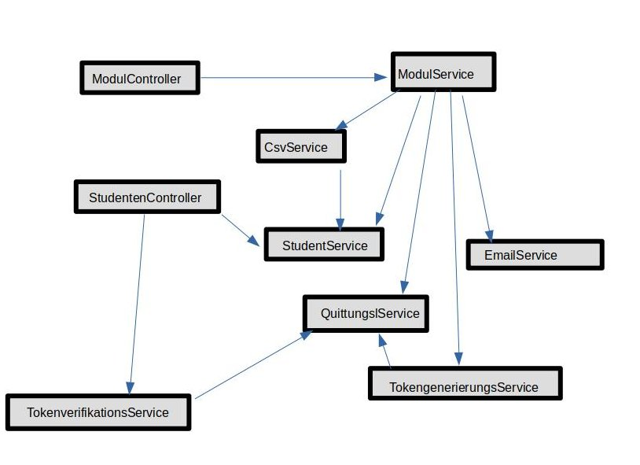

== Abschnitt 8 Konzepte
=== Aufgabe 8.1 Abhängigkeiten
    Die Datenbank stellt den Repositories Daten zur Verfügung,
    welche von den Services aufgerufen werden. Diese widerum werden
    von den Controllern aufgerufen, welche die Benutzerschnittstelle
    implementieren.

=== Aufgabe 8.2 Domänenmodell

=== Aufgabe 8.3 Benutzeroberfläche
    Das Klausurzulassungssystem besitzt eine grafische Weboberfläche.
    Sie benutzt das Mops-Styleguide. Über die Controller wird in Verbindung mit
    Thymeleaf die Logik abgefragt und angezeigt.

=== Aufgabe 8.4 Fehlerbehandlung
    Für Fehler gibt es zugehörige Error Seiten, welche dann aufgerufen werden.
    Es gibt eine 403, 404 und 500 Error Seite.

=== Aufgabe 8.5 Testbarkeit
    Die Module des Klausurzulassungssystem werden durch umfangreiche Tests getestet.
    Zum Testing werden JUint Tests mit Spring-Test-Erweiterung genutzt.
